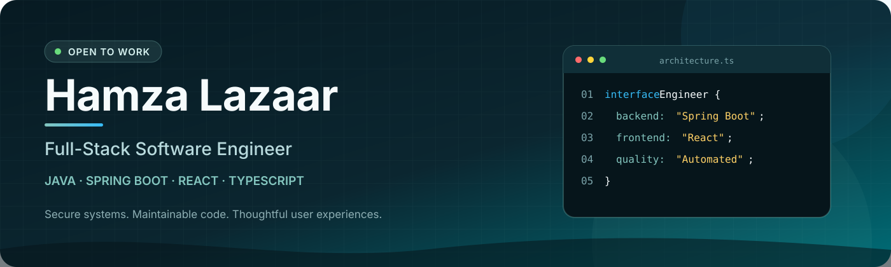
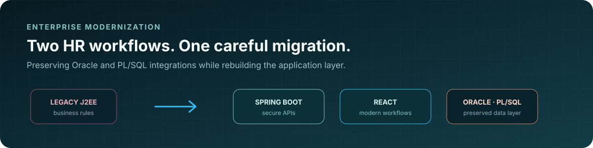
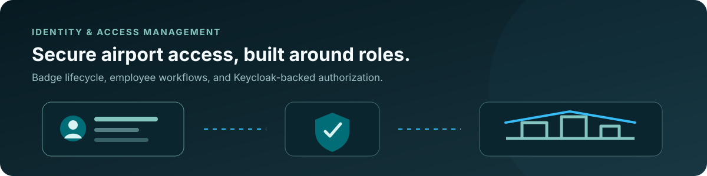
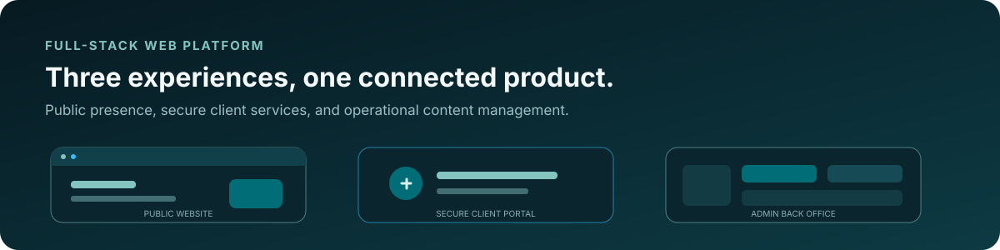

  

   

  
  
  

## Hello, I'm Hamza 👋

I'm a **software engineer with a full-stack background**, specializing in **Java/Spring Boot** and **React/TypeScript**. I build secure APIs, modernize business-critical applications, and develop reliable user experiences supported by automated testing.

I recently earned my engineering degree in **Computer Science (Génie Informatique)** from **ENSA Agadir**, after completing my end-of-studies internship at **VOID Agency** in Casablanca in July 2026.

`📍 Casablanca, Morocco` · `💼 Open to opportunities` · `🎓 Software Engineer — ENSA Agadir` · `🌍 French C2 & Advanced English`

## Engineering highlights

| | |
| :--- | :--- |
| **2 enterprise HR workflows modernized** | Rebuilt from a legacy J2EE application using Spring Boot and React |
| **3 professional internships** | Experience at VOID Agency, Royal Air Maroc, and Ralydev Technology |
| **End-to-end development** | Backend APIs, frontend applications, access control, and automated tests |
| **Quality-focused engineering** | JUnit, Mockito, Vitest, Playwright, and SonarQube |

## Selected work

### Enterprise HR Process Modernization

**VOID Agency · Barid Al-Maghrib · End-of-studies internship · 2026**

Modernized two business-critical HR processes from a legacy J2EE monolith to **Spring Boot and React**, while preserving the existing Oracle schema and PL/SQL procedures.

Reverse-engineered complex calculation rules, rebuilt hierarchical approval workflows, implemented traceability, and managed authentication and authorization with Keycloak.

`Java 21` `Spring Boot 3` `React` `TypeScript` `Oracle` `PL/SQL` `Keycloak`

> 🔒 Private enterprise project — source code and business data are confidential.

---

### Badge & Airport Access Management

**Royal Air Maroc · Application internship · 2025**

Built a full-stack application for badge and airport-access management, with dedicated administrator and employee experiences. Implemented authentication and role-based access control through Keycloak.

`Spring Boot` `React` `PostgreSQL` `Keycloak`

> 🔒 Private enterprise project — source code and operational data are confidential.

---

### Full-Stack Web Platform

**Ralydev Technology · PFA internship · 2025**

Developed a platform combining a public-facing website, a JWT-secured client portal, and an administrative back office for content management and request tracking.

`Java` `Spring Boot` `React` `JWT`

> 🔒 Internship project — source code is not publicly available.

## Core toolkit

<table>
  <tr>
    <td valign="top" width="50%">
      <strong>Backend & APIs</strong>  
      
      
      
      
    </td>
    <td valign="top" width="50%">
      <strong>Frontend</strong>  
      
      
      
      
    </td>
  </tr>
  <tr>
    <td valign="top" width="50%">
      <strong>Data & Security</strong>  
      
      
      
      
    </td>
    <td valign="top" width="50%">
      <strong>Testing & Delivery</strong>  
      
      
      
      
      
    </td>
  </tr>
</table>

## What I care about

- Designing clear boundaries between domain logic, APIs, and user interfaces
- Making security and authorization part of the architecture—not an afterthought
- Using automated tests and static analysis to ship with confidence
- Understanding existing systems before replacing or modernizing them

   
  <strong>Interested in building reliable products with thoughtful engineering?</strong>
    
  
    
  Casablanca, Morocco · Open to backend and full-stack software engineering opportunities

